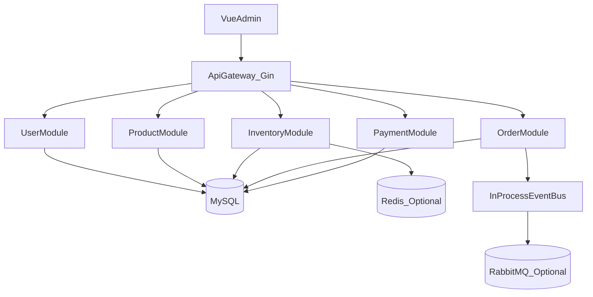
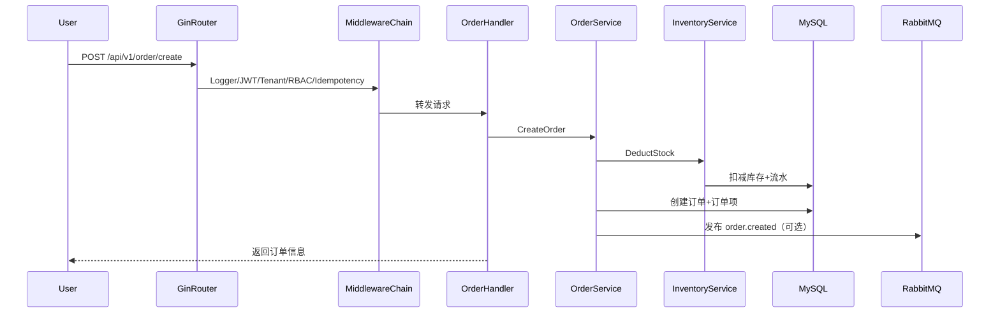

# Go ERP 架构概览

## 1. 架构路线

项目采用“模块化单体 + 可演进微服务”路线：

1. 当前阶段：模块化单体（单进程部署，领域内分层清晰）。
2. 中期阶段：按领域边界拆出独立服务（User/Product/Inventory/Order）。
3. 后期阶段：按流量与复杂度按需微服务化。

## 2. 运行流程

1. `cmd/server/main.go` 加载配置（`APP_ENV` -> `configs/config.<env>.yaml` -> 回退 `configs/config.yaml`）。
2. `internal/bootstrap` 初始化 Logger、DB、Redis、RabbitMQ。
3. 执行 `AutoMigrate` 自动迁移核心业务表。
4. 构建应用容器（Repository -> Service -> Handler）。
5. 初始化 Gin Router，挂载中间件与业务路由。
6. 启动 HTTP 服务并支持 `SIGINT/SIGTERM` 优雅关闭。

## 3. 分层职责

- `internal/domain`：领域实体（用户/商品/库存/订单/支付）。
- `internal/repository`：数据访问层（GORM 持久化）。
- `internal/service`：业务规则与编排（库存扣减、订单创建、支付回调）。
- `internal/handler/http`：HTTP 协议层（参数绑定、调用服务、返回响应）。
- `internal/middleware`：横切中间件（日志、JWT、租户、RBAC、幂等）。
- `pkg/*`：基础类库（错误、响应、JWT、缓存、锁、事务、消息、事件）。

## 4. 中间件链路

全局链路顺序：

`Logger -> Recovery -> JWT -> Tenant -> RBAC -> Idempotency -> Handler`

说明：
- `Logger` 负责生成 `trace_id` 并记录请求日志。
- `JWT` 负责解析 token 并注入 `user_id/tenant_id/role`。
- `Tenant` 校验租户上下文存在。
- `RBAC` 做最小权限判断（可按策略扩展）。
- `Idempotency` 基于 `Idempotency-Key` 防重复提交（支付等场景）。

## 5. 数据与基础设施

- 数据库：MySQL/PostgreSQL（GORM）。
- 缓存：Redis（可选启用），库存采用 `stock:sku:{id}` 预扣策略。
- 消息队列：RabbitMQ（可选启用），订单创建后发布事件。
- 事件总线：进程内 `pkg/event` + 可选 MQ 发布器。

## 6. 业务模块（MVP）

- 用户模块：用户创建、登录发 token、`/users/me` 查询。
- 商品模块：SPU/SKU 基础新增与查询。
- 库存模块：扣减接口 + Redis 预扣 + MySQL 扣减与流水。
- 订单模块：下单、查单、状态更新。
- 支付模块：回调入库、幂等处理、订单支付状态更新。

## 7. 架构图（Mermaid）

### 7.1 模块组件图

### 7.2 请求时序图（创建订单）

## 8. 下一步建议

1. 将库存 Lua 脚本升级为单 key 读写合一并加压测基线。
2. 为 Outbox 增加指数退避与告警指标（失败率、堆积量）。
3. 为超时取消链路增加死信重试与可观测看板。
4. 补齐业务级测试：订单创建、支付回调幂等、库存回滚。
5. 为各领域模块定义清晰 API 契约，为服务拆分做准备。

## 9. 高可靠闭环（已落地）

### 9.1 库存防超卖（Lua 原子脚本）

- 在 `internal/service/inventory/service.go` 使用 `EVAL` 执行原子脚本：
  - 不存在库存 key 返回 `-2`（回源 DB 预热后再扣减）
  - 库存不足返回 `-1`
  - 成功则 `DECRBY`
- 当 DB 扣减失败时，会执行 Redis 回补，避免缓存与 DB 长期偏差。

### 9.2 Outbox 最终一致性

- 新增表：`order_outbox_events`（模型 `internal/domain/order/outbox.go`）。
- 新增死信归档：`order_outbox_dead_letters`（超过最大重试后归档失败事件）。
- 下单事务内同步写入：
  - `order.created`
  - `order.timeout.delay`
- 后台 `OutboxDispatcher` 轮询 pending 事件并发布 MQ：
  - 发布成功 `MarkSent`
  - 发布失败 `MarkRetry`（指数退避重试）
  - 达到 `mq.outbox_max_retry` 后 `MarkDead` 并归档到死信表

### 9.3 订单超时取消（延迟队列）

- MQ 拓扑（`internal/bootstrap/mq.go`）：
  - 延迟队列：`order.timeout.delay.q`，绑定 `order.timeout.delay`，配置 `x-message-ttl`
  - 死信转发：`order.timeout.process`
  - 消费队列：`order.timeout.process.q`
- 消费逻辑（`App.StartBackgroundWorkers`）：
  - 读取 `order.timeout.process.q`
  - 调用 `OrderService.HandleTimeoutMessage`
  - 仅取消 `pending_payment` 状态订单
